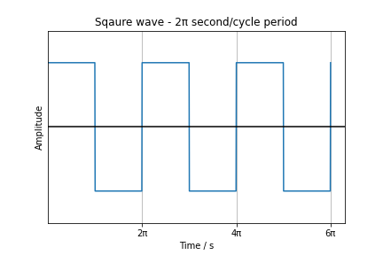

# Introduction

This article intends to explain how to do Fourier anaysis, which transforms suqare wave into a series of sum of sins and cosines. 

Fourier transformations shed light on how sqaure wave get transformed into sins and cosines with different frequencies and get reconstructed later back into square wave without losing intended information.

# Fourier Transform

This square wave function can be deccomposed like this:

> *f(t)=a0 + a1cos(t) + a2cost(2t) + a3cost(3t)+ ...*
> *+ b1sin(t) + b2sin(2t) + b3sin(3t) + ...*

# Reference

1. [Plotting A Square Wave Using Matplotlib, Numpy And Scipy](https://pythontic.com/visualization/waveforms/squarewave)